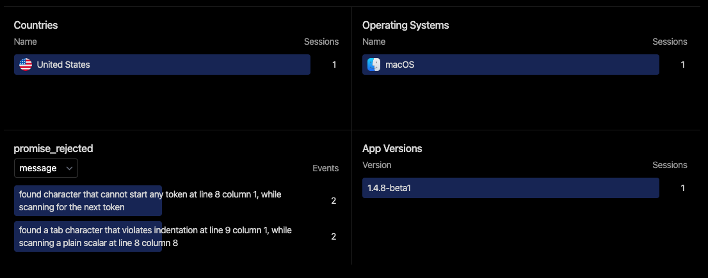

Rust developers strive to sidestep panics at all costs, yet, they occasionally occur, causing your application to crash. In this article, we delve into strategies for managing panics in Tauri applications and share insights on mitigating their likelihood.

## Understanding Panics in Rust

In the context of Rust, a panic signifies an irretrievable error — a situation where the program cannot proceed due to an insurmountable issue.

Rust functions typically return a `Result<T, E>` value, granting you control over how to respond to potential errors. However, when employing third-party crates or crafting your own code, you may encounter scenarios where `unwrap` and `expect` are utilized.

These functions induce a panic if the result equates to an Err value. Developers often employ `unwrap` or `expect` when they are certain that the outcome will always be an Ok value. However, in the event of an unforeseen error, a panic ensues, halting the program.

## How to handle panics in Tauri apps

One of the significant challenges with application crashes is their unpredictability. You might have thousands of users, but the detection of crashes remains elusive unless a user reports the issue - a rare occurrence.

As an initial step towards resolving this, we'll explore how to receive notifications when a panic arises.

Since Tauri operates as a Rust app, we can harness the built-in panic hook to monitor and handle these panics. Consider the following example:

```rust
use std::panic;

fn main() {
    std::panic::set_hook(Box::new(|info| {
        error!("Panicked: {:?}", info);
    }));

    tauri::Builder::default()
        .run(tauri::generate_context!())
        .expect("error while running tauri application");
}
```

The above code logs an error message whenever a panic arises. Moreover, you can employ the info parameter to gain additional insights about the panic. Converting the `info` into a string yields a useful message that includes the file and line where the panic occurred.

Within this hook, you're free to implement any course of action! While the above example suffices during development — as you can view logs in your console — it may not be as effective in a production setting since you would not have immediate access to this information.

## Panic Management in Production

In a production release, there are several strategies to address application crashes:

**1. Log the error to a file**

Unfortunately, at this stage, the [Tauri Log Plugin](https://aptabase.com/blog/complete-guide-tauri-log) is not initialized and thus can't be utilized. However, the `std::fs` module can be employed to write error details into a file. Should a user report an issue, you can request them to share this file with you.

**2. Transmit the error to a server**

This alternative is generally more advantageous, as it allows you to obtain error information without requiring users to send files. However, it's crucial to consider privacy implications and ensure no sensitive user information is inadvertently sent to remote servers.

While [Aptabase](/) is not primarily designed as a crash reporting service, it can be leveraged as a lightweight and privacy-conscious solution for this purpose.

Have a look at this example:

```rust
use std::panic;

fn main() {
    tauri::Builder::default()
        .plugin(
            tauri_plugin_aptabase::Builder::new("YOUR_KEY_HERE")
                .with_panic_hook(Box::new(|client, info| {
                    client.track_event("panic", Some(json!({
                        "info": format!("{:?}", info)
                    })));
                }))
                .build(),
        )
        .run(tauri::generate_context!())
        .expect("error while running tauri application");
}
```

This code closely resembles the previous example, but rather than writing the error to a file, it transmits it to Aptabase. Consequently, you can view the errors, alongside other analytics, directly from your Aptabase dashboard.

In addition to this, Aptabase can be utilized on the frontend to monitor errors occurring within the webview. Here's an example of how to catch all unhandled rejections (promises) and other errors:

```ts
import { trackEvent } from "@aptabase/tauri";

addEventListener("unhandledrejection", (e) => {
  trackEvent("promise_rejected", {
    message: (e.reason?.message || e.reason || e).toString(),
  });
});

window.addEventListener("error", (e) => {
  trackEvent("js_error", {
    message: e.message,
  });
});
```

And here's what the error reporting looks like on the Aptabase dashboard.



This is an aggregated view of all errors, so you can easily identify the most common issues, what app versions they occur in and the operating system used by the user.

## Conclusion

I've been using this in my personal Tauri applications and have found it to be a highly effective, yet simple, technique for panic management. While it doesn't provide a complete solution, it significantly advances your journey towards enhancing the stability of your app.

If you have any questions or feedback, feel free to reach out to me on [Twitter](https://twitter.com/goenning) or join us on [Discord](https://discord.gg/d9d97unCUk) and I'll be happy to help!
