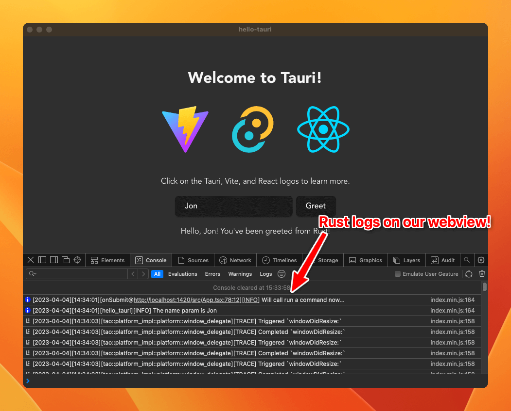

In this guide, we'll cover everything you need to know about logging with Tauri. We'll dive into the specific logging capabilities of Tauri, how to install the official plugin, how to generate logs from both Rust and Javascript, how to configure your application to filter the various types of events.

Whether you're a beginner or an experienced developer, this guide has something for everyone. By the end of it, you'll have a comprehensive understanding of how to effectively log with Tauri and how to use those logs to improve your application. So, let's get started!

## Standard Logging

The first thing you need to know is that apps created with Tauri do not have any logging capabilities by default. It may sound like a negative thing, but it's actually a good thing. It means that you can choose the logging library that best suits your needs.

The one we'll explore on this guide is the official [Tauri Log Plugin](https://github.com/tauri-apps/tauri-plugin-log), which is based on the highly popular [log](https://crates.io/crates/log) Rust crate.

To get started let's install the log crate by adding it to our Cargo.toml file:

```toml
[dependencies]
...
log = "^0.4"
```

This crate adds various macros that you can use to generate logs from Rust. The most common ones are `info!`, `warn!`, `error!`, and `debug!`. So let's try adding it to one of our commands:

```rust
#[tauri::command]
fn greet(name: &str) -> String {
    info!("The name param is {}", name);

    format!("Hello, {}! You've been greeted from Rust!", name)
}
```

If you run the app and look for logs, you won't see anything. That's because we haven't configured the log outputs for the app. That's where the official Tauri Log Plugin comes in, not only does it provide a way to output logs to various destinations, but it also provides a way to filter logs and has a JavaScript library to log from JavaScript.

## Installing the Tauri Log Plugin

We start by adding the plugin crate to our Cargo.toml file:

```toml
[dependencies]
...
log = "^0.4"
tauri-plugin-log = { git = "https://github.com/tauri-apps/plugins-workspace", branch = "dev" }
```

Now we just need to add the plugin to Tauri's build pipeline on the `main.rs` file:

```rust
fn main() {
    tauri::Builder::default()
        .plugin(tauri_plugin_log::Builder::default().build()) // <-- this line here
        .invoke_handler(tauri::generate_handler![greet])
        .run(tauri::generate_context!())
        .expect("error while running tauri application");
}
```

If we launch the app and trigger the command again, we now see our log message on the terminal, alongside a few other messages too!

```
[2023-04-04][14:11:11][tao::platform_impl::platform::window_delegate][TRACE] Triggered `windowDidResignKey:`
[2023-04-04][14:11:11][tao::platform_impl::platform::window_delegate][TRACE] Completed `windowDidResignKey:`
[2023-04-04][14:11:12][tao::platform_impl::platform::window_delegate][TRACE] Triggered `windowDidBecomeKey:`
[2023-04-04][14:11:12][tao::platform_impl::platform::window_delegate][TRACE] Completed `windowDidBecomeKey:`
[2023-04-04][14:11:17][hello_tauri][INFO] The name param is Jon
```

## Logging from JavaScript

The beauty of the Tauri is that you can do almost anything by using JavaScript only, and logging is no exception. The Tauri Log Plugin comes with a JavaScript library that you can use to log from JavaScript.

You can install it with npm (or yarn/pnpm):

```sh
npm add https://github.com/tauri-apps/tauri-plugin-log
```

And then import the same `info`, `warn`, `error`, and `debug` functions from the library:

```js
import { info } from "tauri-plugin-log-api";

function App() {
  ...
  async function greet() {
    info("Will call run a command now...") // <-- this line here

    await invoke("greet", { name });
  }
...
```

If you run the app again you'll see the message on the terminal alongside the other logs from Rust.

You may thing it's over, but it's not. Keep reading for some extra neat features.

## Configuring the Tauri Log Plugin

By the default, the plugin will output logs to:

- **Stdout**, which is your terminal if you're running it from development;
- **Log file**, located on the user's home directory. [Where to find log files from Tauri Apps?](/blog/where-to-find-tauri-logs);

But this plugin (like many others) is highly configurable, so you can change the logging output, as well as a few others settings.

Let's explore a few things we can do.

### 1. Output to the webview console

If you spend most of your time developing your app with the devtools open, you might find it useful to have the logs output to the webview console. We can do that by adding the `LogTarget::Webview` as a target to the plugin:

```rust
use tauri_plugin_log::LogTarget;

.plugin(tauri_plugin_log::Builder::default().targets([
    LogTarget::Stdout,
    LogTarget::Webview,
]).build())
```

With the example above, logs will be forwarded to both the terminal and the webview console. To actually see the logs on the webview console, you'll need to call the `attachConsole` from JavaScript, ideally as early as possible on your index.ts/js file:

```ts
import React from "react";
import ReactDOM from "react-dom/client";
import App from "./App";
import { attachConsole } from "tauri-plugin-log-api";

attachConsole(); // <-- this line here

ReactDOM.createRoot(document.getElementById("root") as HTMLElement).render(
  <React.StrictMode>
    <App />
  </React.StrictMode>
);
```



You might also find useful to have different output targets for debug and release builds, which can be achieve with:

```rust
#[cfg(debug_assertions)]
const LOG_TARGETS: [LogTarget; 2] = [LogTarget::Stdout, LogTarget::Webview];

#[cfg(not(debug_assertions))]
const LOG_TARGETS: [LogTarget; 2] = [LogTarget::Stdout, LogTarget::LogDir];

.plugin(tauri_plugin_log::Builder::default().targets(LOG_TARGETS).build())
```

The code above will use stdout and logdir for release builds, and stdout and webview for debug builds.

You can use the same technique for the other settings we'll explore next.

### 2. Colorized output

Some logs are definitely more important than others, so it's nice to have a way to differentiate them. The Tauri Log Plugin allows you to colorize the various different log levels, so you can easily spot the important ones.

We start by enabling the `colored` feature on the plugin crate:

```toml
...
log = "^0.4"
tauri-plugin-log = { git = "https://github.com/tauri-apps/plugins-workspace", branch = "dev", features = ["colored"] }
```

And then enabling it on the plugin builder:

```diff
.plugin(
    tauri_plugin_log::Builder::default().targets([
        LogTarget::Stdout,
        LogTarget::Webview,
    ])
+   .with_colors(ColoredLevelConfig::default())
    .build()
)
```

And that's it! Now you'll see the logs with different colors depending on the level, such as red for errors and yellow for warnings. This is another setting you might want to have different configurations for debug and release builds.

### 3. Filtering unwanted logs

Last configuration we'll explore is the ability to filter unwanted logs. As you might have noticed, there's quite a bit of noise on the terminal due to Tauri's internal logs.

The `log` crate is very popular, so it's very likely that you'll eventually add a dependency that uses it too for its own logging, which will show up alongside your own logs.

The first thing we can do in terms of filtering is to raise the minimum log level. By default, the plugin will output all logs, but we can change that by setting the minimum log level:

```diff
+ use log::LevelFilter;

.plugin(
    tauri_plugin_log::Builder::default().targets([
        LogTarget::Stdout,
        LogTarget::Webview,
    ])
    .with_colors(ColoredLevelConfig::default())
+   .level(LevelFilter::Warn)
    .build()
)
```

The code above will only output logs with a level of `warn` or higher, which might be a good fit for a release build.

But in case it's filtering too much, we can also filter by module. The plugin allows you to specify a list of modules and the respective log level to filter, which is useful if you want to filter out a specific dependency's logs:

```diff
.plugin(
    tauri_plugin_log::Builder::default().targets([
        LogTarget::Stdout,
        LogTarget::Webview,
    ])
    .with_colors(ColoredLevelConfig::default())
+   .level_for("tauri", LevelFilter::Info)
+   .level_for("hyper", LevelFilter::Info)
    .level(LevelFilter::Debug)
    .build(),
)
```

The code above will only output logs from `tauri` and `hyper` modules with a level of `info` or higher, while keeping logs from other modules with a level of `debug` or higher.

## Conclusion

That's it, you now know how to log from Rust and JavaScript, as well as how to configure the Tauri Log Plugin to your liking. I hope this post was useful to you!

If you're interested on gettings insights on how your users are using your app, you might want to check out [Aptabase](https://aptabase.com), a privacy-first analytics platform that respects your users' privacy.

See you on the next article 👋
