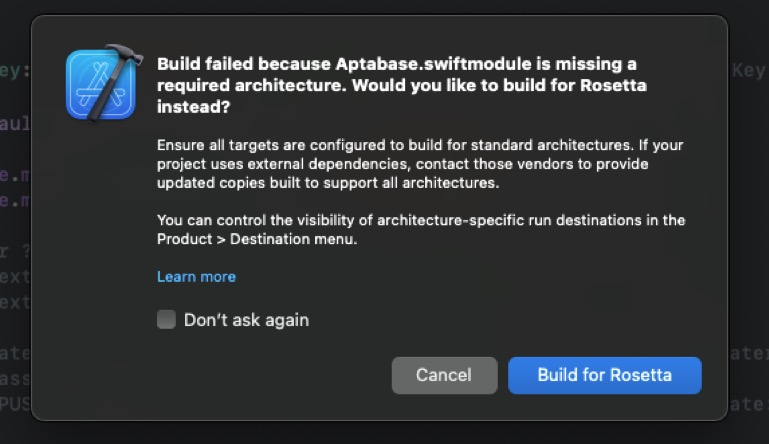
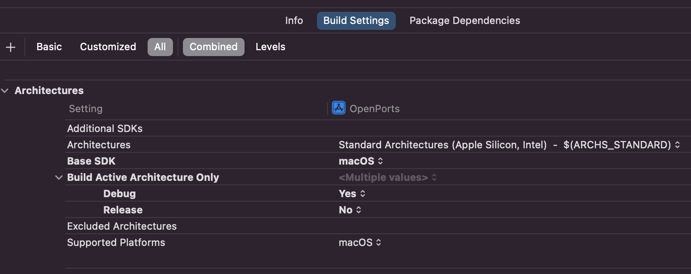

When a developer recently tried to use the [Aptabase](https://github.com/aptabase/aptabase-swift) Swift SDK on their project, they got the following error on Xcode:

> Build failed because Aptabase.swiftmodule is missing a required architecture. Would you like to build for Rosetta instead?

> Ensure all targets are configured to build for standard architectures. If your project uses external dependencies, contact those vendors to provide updated copies built to support all architectures. You can control the visibility of architecture-specific run destinations in the Product > Destination menu.

I had never seen this error before, so I decided to investigate it and document the solution here.

## Where to start?

Three things caught my attention:

- `Aptabase.swiftmodule is missing a required architecture`. The Aptabase package is distribute as source code, it's not prebuilt. How come is it missing an architecture if it's being built from source?
- `Would you like to build for Rosetta instead?`. This message seems to indicate that building for Intel was possible, but not for Apple Silicon. This is bad, this package shouldn't force developers to use Rosetta.
- `If your project uses external dependencies, contact those vendors to provide updated copies built to support all architectures.`. Finally, this is the worst part. It seems to indicate that the Aptabase was pre-built and distributed as a binary, which is not the case.

I believe this a bug on Xcode, but I'm not sure yet. During my research I also found this [recent question on StackOverflow](https://stackoverflow.com/questions/75948233/in-m1-machine-ventura13-3-xcode-14-3-build-error-with-undefined-symbol-on-all) with the same error, but for the Stripe Swift SDK and a few others.

In any case, I decided to dig deeper and see if I could find a solution.

## Troubleshooting Process

When in doubt, I usually try to replicate these errors on a fresh new project. This helps me to isolate the problem and find a solution.

To my surprised, after starting a new macOS app project and adding the Aptabase Swift Package, I did not get the error. The project built and ran just fine.

This was a good sign, it meant that the problem was not with the Aptabase Swift Package, but with the project using the package. This also invalidates the message from Xcode saying that the package was missing an architecture and the need to contact the vendor to provide a new binary.

My next move was to try replicating the error on the original project by changing the build settings. For a fresh new macOS app, the default settings are:

If I change the `Build Active Architecture Only` setting to `No` on Debug (default is `Yes`), I was able to replicate the error. Which is really odd because the Release configuration was set to `No` by default and it was working fine.

The solution in this instance was to change the `Build Active Architecture Only` setting to `Yes` for Debug and `No` for Release configurations, which is the default for a new macOS app anyway.

## Conclusion

It's very likely that there may be other reasons why this error may appear for you and the solution described above may not work. The other settings such as `Architectures` and `Excluded Architectures` may also be a factor.

If you are getting this error, I recommend you to follow a similar troubleshooting process as I did to isolate the problem and guide you to a solution.

**Note:** This is actually how I usually solve most of the problems I encounter. I try to replicate the error on a fresh new project and then I compare the settings between the two projects to see what's different. Works most of the time :)

I hope this helps you to solve your problem. If you have any questions, feel free to reach out to me on [Twitter](https://twitter.com/goenning).
