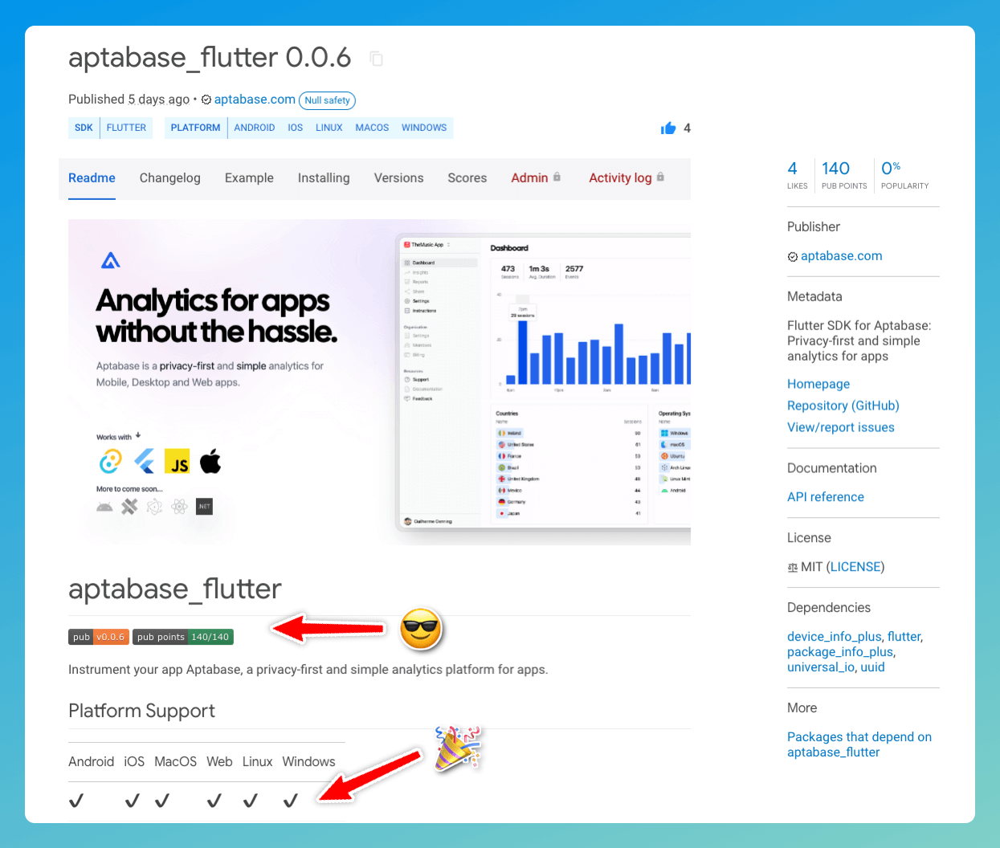
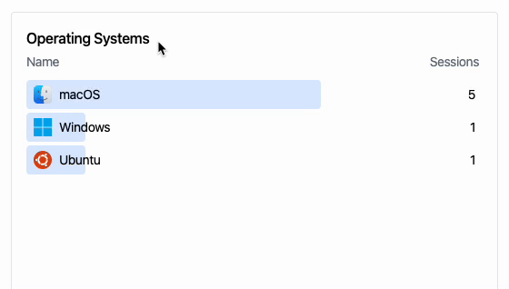

Hey there 👋

Welcome to the first of many product update post. In this post we'll be talking about a few new features we've added to our product that we think you'll love.

## Flutter Web

All our SDKs are open sourced at [github.com/aptabase](https://github.com/aptabase) and we've been working on a Flutter SDK for a while now. We've had support for Android, iOS, macOS, Linux and Windows since day one. But thanks to a [community contribution](https://github.com/aptabase/aptabase_flutter/pull/1) we now also have support for Flutter Web.

So as of today, the SDK supports all Flutter platforms 🎉 Not only that, but [adrianflutur](https://github.com/adrianflutur) also helped us get to 140/140 points on pub.dev. How cool is that?

You can find the Flutter SDK on [pub.dev](https://pub.dev/packages/aptabase_flutter) as usual. You don't have to add/modify anything, just update to the latest version of the SDK and you're good to go.



## Logging events from Rust with Tauri

Up until now, we've only had support for logging events from JavaScript, which is likely where you'll be doing most of your logging. But sometimes it can be useful to log it from Rust, for example, when the app is starting up.

Starting from version 0.1.4 of the [tauri-plugin-aptabase](https://crates.io/crates/tauri-plugin-aptabase), you can now log events from Rust. We've taken careful consideration to make sure that the API is as similar as possible to the JavaScript API, as well as making it blend nicely with Tauri itself.

Here's an example of how you can log an event from Rust:

```rust
use tauri_plugin_aptabase::EventTracker;

fn main() {
    tauri::Builder::default()
        .plugin(tauri_plugin_aptabase::init("<YOUR_APP_KEY>".into()))
        .setup(|app| {
            app.track_event("app_started", None);
            Ok(())
        })
        .run(tauri::generate_context!())
        .expect("error while running tauri application");
}
```

The `track_event` method is available on `App`, `AppHandle` or `Window`, allowing you to log events from pretty much anywhere in your app, including commands and event hooks.

We hope you like this new feature. If you have any feedback, please let us know in our [repo](https://github.com/aptabase/tauri-plugin-aptabase).

## UI Navigation

Alright, enough of the SDK updates. Let's talk about the UI portal for a bit. We've recently added the ability to drill down into your data. This means that you can now look at regions of a country, or operating system versions, or even specific events.

Here's a quick demo of how it works when selecting an operating system:



It's a similar experience when selecting a country or an event. Go give it a try and let us know what you think. It's a small feature, but we think it's a big step forward for Aptabase. We're really excited about this and we hope you are too 😊

Till next time! 👋
