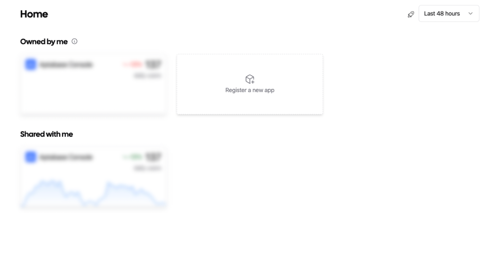
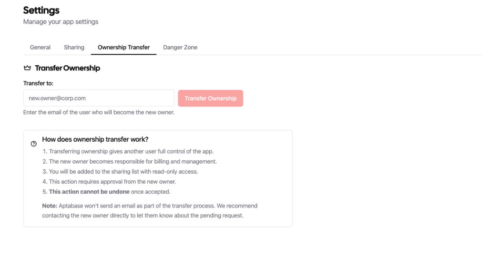

Hey there 👋

We're back with a product update! This time we're tackling a common scenario that many of you have encountered.

## The Problem

As maintainers, we often receive support requests like: *"I updated my billing plan but it didn't unlock my application."*

After investigating, we found that in most cases, the confusion stems from the difference between **owned apps** and **shared apps**. An app is visible to you if you own it, or if it has been shared with you by another owner. However, the billing plan only applies to the apps you own, not the ones shared with you.

## Visual Indicators

To clear up this confusion, we've introduced a visual indicator to help you distinguish between apps you own and apps that are shared with you.

Now, you can easily see which apps are "Owned by me" and which ones are "Shared with me" right from the dashboard.

## Transfer Ownership

But we didn't stop there. We realized that sometimes you might want to transfer ownership of an app to another user. Maybe you created an app for a client and now want to hand it over, or perhaps you're moving an app to a different account.

We've added the ability for the owner of an app to transfer it to another user. You can find this new option in the **Settings** page under the **Ownership Transfer** tab.

### How it works

Once you initiate an app transfer, the process is simple but secure:

1.  **Initiate Transfer:** Enter the email address of the user you want to transfer the app to.
2.  **Acceptance:** The transfer needs to be accepted by the other user.
3.  **Completion:** Once accepted, the ownership is transferred, and the new owner takes full control of the app, including billing responsibility.

We hope these changes make managing your apps and collaborations much smoother. As always, if you have any feedback or questions, feel free to reach out!

Happy coding! 🚀
