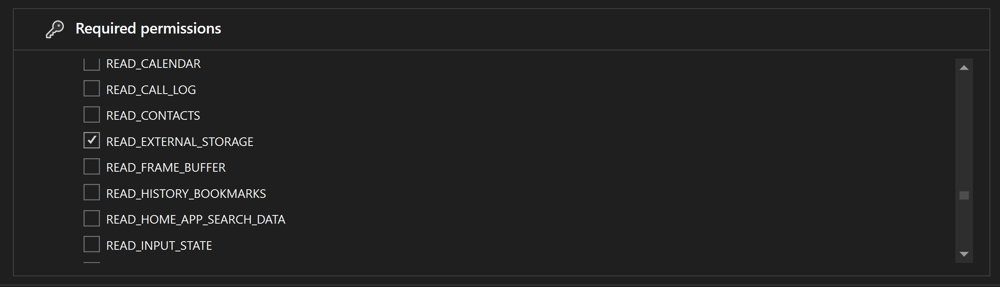
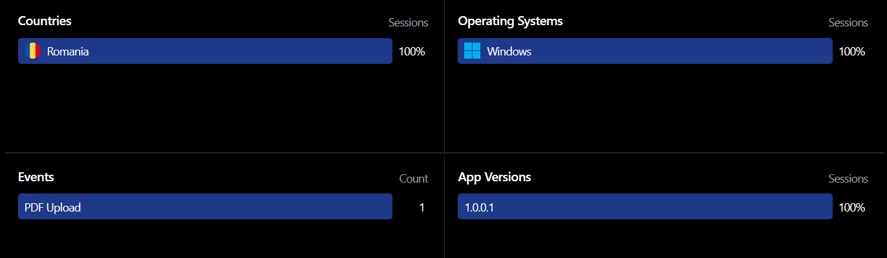

Creating a .NET MAUI app that selects and reads a file from disk, compatible with iOS, Android, Windows, macOS, and Linux, involves using a few key components of the MAUI framework like configuring permissions and using the `FilePicker` API.

## 1. Setup the MAUI Project

First, you need to set up a new MAUI project if you haven't done so already. You can do this using the .NET CLI:

```bash
dotnet new maui -n MyPdfReader
```

This command creates a new MAUI project with a default configuration for all supported platforms.

## 2. Configure Permissions

Since your app will be accessing the file system, you need to make sure that you have the appropriate permissions set up for each platform:

- ✅ Android: Edit the `AndroidManifest.xml` to include the necessary permissions.
- ✅ iOS: Edit the `Info.plist` to request permissions.
- ✅ Windows, macOS, Linux: Typically, desktop applications will have access, but you might want to handle exceptions or user-denied permissions.

#### Android Permissions

For Android, you need to request permission to access external storage if you plan to read files from locations other than the app's private storage. Edit the `AndroidManifest.xml` file located in the `Platforms\Android` directory:

```xml
<uses-permission android:name="android.permission.READ_EXTERNAL_STORAGE" />
```



This permission prompts the user to allow the app to read from the device's external storage.

#### iOS Permissions

iOS requires a description of why the app needs access to certain features like the photo library or external documents. Edit the `Info.plist` file located in the `Platforms\iOS` directory:

```xml
<key>NSDocumentPickerUsageDescription</key>
<string>Access is needed to read PDF files.</string>
```

This configuration ensures that when your app attempts to access the document picker, iOS knows to display a prompt to the user with this explanation.

### 3. Use FilePicker API

.NET MAUI provides a [FilePicker API](https://learn.microsoft.com/en-us/dotnet/maui/platform-integration/storage/file-picker) that is part of `Microsoft.Maui.Storage`, which you can use to open a file picker dialog that works across all platforms:

```csharp
public async Task ReadFileAsync()
{
    try
    {
        var filePickerTypes = new FilePickerFileType(
            new Dictionary<DevicePlatform, IEnumerable<string>>
            {
                { DevicePlatform.iOS, [ "public.text" ] },
                { DevicePlatform.Android, [ "text/plain" ] },
                { DevicePlatform.WinUI, [ ".txt" ] },
                { DevicePlatform.MacCatalyst, [ "txt" ] },
                { DevicePlatform.Tizen, new[] [ "*/*" ] }
            });

        var options = new PickOptions
        {
            PickerTitle = "Please select a text file",
            FileTypes = filePickerTypes,
        };

        var result = await FilePicker.Default.PickAsync(options);

        if (result != null)
        {
            var fileContents = await File.ReadAllTextAsync(result.FullPath);
            Console.WriteLine("File contents: " + fileContents);
        }
    }
    catch (Exception ex)
    {
        Console.WriteLine("Error accessing file: " + ex.Message);
    }
}
```

### Reading PDF Files

To handle PDF files specifically, you'll need to update the `FilePickerFileType` configuration to recognize PDF file types across different platforms:

```csharp
var filePickerTypes = new FilePickerFileType(
    new Dictionary<DevicePlatform, IEnumerable<string>>
    {
        { DevicePlatform.iOS, [ "com.adobe.pdf" ] },
        { DevicePlatform.Android, [ "application/pdf" ] },
        { DevicePlatform.WinUI, [ ".pdf" ] },
        { DevicePlatform.MacCatalyst, [ "pdf" ] }
    });
```

The example given above reads text files, and PDFs are not plain text. To actually read or manipulate PDFs, you might need to use a library like `PdfSharp` or `PdfPig` in .NET:

```bash
dotnet add package PdfPig
```

```csharp
using UglyToad.PdfPig;

using var document = PdfDocument.Open(result.FullPath);
foreach (var page in document.GetPages())
{
    var text = page.Text;
    Console.WriteLine("PDF page text: " + text);
}
```

## 4. Add UI for File Selection

In your `MainPage.xaml`, add a button or similar UI element to trigger the file selection:

```xml
<VerticalStackLayout>
    ..
    <Button Text="Select File"
            Clicked="OnSelectFileClicked" />
    <Label x:Name="fileContentLabel" />
    ..
</VerticalStackLayout>
```

## 5. Handle Button Click

In your `MainPage.xaml.cs`, handle the button click to invoke the file picker:

```csharp
public partial class MainPage : ContentPage
{
    public MainPage()
    {
        InitializeComponent();
    }

    private async void OnSelectFileClicked(object sender, EventArgs e)
    {
        await ReadFileAsync();
    }
}
```

## 6. Run and Test Your App

Run your app on various platforms using the .NET CLI or Visual Studio. Check to ensure that the file picker works as expected and that the file reading functionality is properly managed.

```bash
dotnet build
dotnet run
```

Make sure to handle exceptions and errors gracefully, particularly around file access permissions and unavailable file types across different platforms. 

## 7. Add Events Tracking

To add analytics to your .NET MAUI application, you can use the `Aptabase.Maui` [NuGet package](https://www.nuget.org/packages/Aptabase.Maui). This package provides a simple way to integrate event tracking in MAUI applications.

#### Setting Up Aptabase

First, you need to get your App Key from [Aptabase](https://aptabase.com/), you can find it in the `Instructions` menu on the left side menu.

Add the `Aptabase.Maui` package to your project. You can do this via the NuGet Package Manager or by running the following command in your project directory:

```bash
dotnet add package Aptabase.Maui
```

After installing the package, you need to initialize Aptabase in your application. Update `MauiProgram.cs`:

```csharp
using Aptabase.Maui;

public static MauiApp CreateMauiApp()
{
    var builder = MauiApp.CreateBuilder();
    builder
        .UseMauiApp<App>()
        .UseAptabase("<YOUR_APP_KEY>", new AptabaseOptions // 👈 this is where you enter your App Key
        {
#if DEBUG
            IsDebugMode = true,
#else
            IsDebugMode = false,
#endif
        })
    ...

  
    builder.Services.AddSingleton<MainPage>(); // 👈 you need to add MainPage to the DI container

    return builder.Build();
}
```

The `UseAptabase()` method will add the `IAptabaseClient` to your dependency injection container, allowing you to use it in your pages and view models.

#### Implementing Event Tracking

Now integrate event tracking within the file picker logic to count the number of pages in each PDF file selected by the user:

```csharp
using UglyToad.PdfPig;
using Aptabase.Maui;

public partial class MainPage : ContentPage
{
    IAptabaseClient _aptabase;

    public MainPage(IAptabaseClient aptabase)
    {
        InitializeComponent();
        _aptabase = aptabase;
    }

    public async Task ReadFileAsync(IAptabaseService aptabaseService)
    {
        ..

        if (result != null)
        {
            using var document = PdfDocument.Open(result.FullPath);

            // Track the event
            _aptabase.TrackEvent("PDF Upload",
                new Dictionary<string, object> { { "PageCount", document.NumberOfPages } });
        }
    }
```

If you check your app in the Aptabase dashboard, you'll now find your custom events:



## Conclusion

At Aptabase, we're developing an [open-source and privacy-centric analytics platform](https://aptabase.com) for desktop and mobile apps. Aptabase has SDKs for various frameworks, including [.NET MAUI](https://github.com/aptabase/aptabase-maui).

If you have any questions or feedback, feel free to reach out on [Twitter](https://twitter.com/aptabase) or join us on [Discord](https://discord.gg/d9d97unCUk) and we'll be happy to help!
