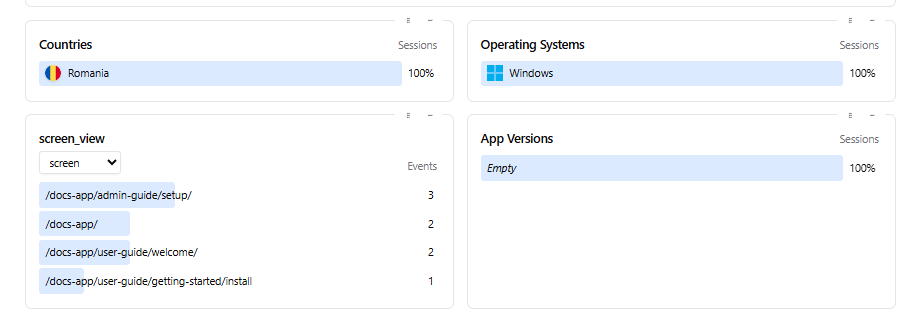

## Why Integrate Aptabase with Docusaurus?

[Docusaurus](https://docusaurus.io/) is a popular static site generator for documentation sites, and [Aptabase](https://aptabase.com/) offers a lightweight, privacy-first way to track user behavior. By combining them, you can gain insights into how users navigate your site and interact with features like search or feedback forms.

This post assumes you have a **Docusaurus** site ready, basic **React** knowledge and want to add **Aptabase** analytics.

**We’ll cover:**
- Configuring the **Aptabase app key**.
- Tracking screen views globally.
- Tracking custom events.

**Let’s get started!**

## Configuring the Aptabase App Key 

To use **Aptabase**, you need an app key, which authenticates your site with the **Aptabase** server. While you could hardcode the key directly in your code, it’s a good practice to store it in `docusaurus.config.js` for better organization and maintainability.

However, let’s be honest: since the **Aptabase app key** is used client-side, it will always be exposed in the browser, so the security benefits of avoiding hardcoding are minimal in this case. Still, using the **Docusaurus** configuration keeps your code cleaner and easier to manage.

### Step 1: Create a `.env` file:

For better flexibility, you can store the **Aptabase app key** in an environment variable. This approach is useful for switching keys between environments (e.g., development vs. production) and aligns with good configuration practices.

- In your **Docusaurus** project root, create a `.env` file (or use `.env.local` for local development).
- Add your environment variables, preferably with a `DOCUSAURUS_` prefix to avoid conflicts:
```plaintext
DOCUSAURUS_APTABASE_APP_KEY=your-actual-app-key
DOCUSAURUS_APTABASE_HOST=https://us.aptabase.com
```
- 💡Ensure `.env` is added to `.gitignore` to prevent committing sensitive data.

### Step 2: **Install `dotenv` (Optional)**:
- **Docusaurus** uses **Webpack**, which automatically loads `.env` files in modern **Node.js** environments. However, to ensure compatibility, you can install the `dotenv` package:
```bash
npm install --save dotenv
```
If you install `dotenv`, you don't need to manually load it in `docusaurus.config.js` because **Docusaurus**'s build process handles it. However, if you need to load it explicitly in custom scripts, you can add `require('dotenv').config()` at the top of those scripts.

### Step 3: Configure `docusaurus.config.js`

- Add the **Aptabase app key** to the `customFields` object in `docusaurus.config.js`. You can either hardcode it or load it from an environment variable.

```javascript
// docusaurus.config.js
module.exports = {
  // Other Docusaurus configurations...
  plugins: [],
  customFields: {
    aptabaseAppKey: process.env.DOCUSAURUS_APTABASE_APP_KEY || '', 
    aptabaseHost: process.env.DOCUSAURUS_APTABASE_HOST || 'https://us.aptabase.com',
  },
  // Other configurations...
};
```

### Step 4: Create the `useAptabase` React Hook

- Install the [@aptabase/web](https://www.npmjs.com/package/@aptabase/web) package:

```bash
npm install @aptabase/web
```

- Create a custom hook to initialize **Aptabase** using the app key from the **Docusaurus** configuration. Use the `useDocusaurusContext` hook to access `customFields`.

```javascript
// src/hooks/useAptabase.js
import { useEffect } from 'react';
import { init } from '@aptabase/web';
import { useDocusaurusContext } from '@docusaurus/useDocusaurusContext';

export const useAptabase = () => {
  const { siteConfig } = useDocusaurusContext();
  const { aptabaseAppKey, aptabaseHost } = siteConfig.customFields;

  useEffect(() => {
    // Only initialize on the client side
    if (typeof window !== 'undefined' && aptabaseAppKey) {
      init(aptabaseAppKey, {
        host: aptabaseHost,
        isDebug: process.env.NODE_ENV !== 'production', // Enable debug logs in development
      });
    }
  }, [aptabaseAppKey, aptabaseHost]); // Re-run if key or host changes
};
```

### Why This Approach?

- Storing the key in `docusaurus.config.js` keeps your code tidy and centralized, making it easier to update or manage across your project.
- Using environment files allows you to switch keys for different environments, though the key’s exposure in the browser means this is more about convenience than security.
- In production, set environment variables via your hosting platform (e.g., [Vercel](https://vercel.com/), [Netlify](https://www.netlify.com/), or CI/CD pipelines) instead of relying on a `.env` file. For example:
  - **Vercel**: Add `DOCUSAURUS_APTABASE_APP_KEY` and `DOCUSAURUS_APTABASE_HOST` in the Vercel dashboard under Environment Variables.
  - **Netlify**: Configure variables in the Netlify UI under Site Settings > Environment Variables.

### Project Structure Example

If you’re new to **Docusaurus**, here’s where the new files from this guide should live in your project:

```plaintext
my-docusaurus-project/
├─ docusaurus.config.js
├─ .env
├─ src/
│  ├─ hooks/
│  │  └─ useAptabase.js       # Custom hook for Aptabase
│  ├─ theme/
│  │  └─ Root.js              # Wraps all pages, sets up global tracking
│  ├─ components/
│  │  ├─ SearchBar.js         # Custom search tracking component
│  │  └─ FeedbackForm.js      # Custom feedback tracking component
│  └─ pages/
│     └─ feedback.js          # Page combining SearchBar + FeedbackForm
```

## Tracking Screen Views Globally

To track page views across your **Docusaurus** site, use the `Root.js` component, which wraps all pages and is perfect for global analytics setup.

By combining the `useAptabase` hook with **Docusaurus**’s `useLocation` hook, you can log a `screen_view` event whenever a user navigates to a new page.

### Setting Up the Root Wrapper

Create or edit `src/theme/Root.js`:

```javascript
// src/theme/Root.js
import React, { useEffect } from 'react';
import { useAptabase } from '../hooks/useAptabase';
import { trackEvent } from '@aptabase/web';
import { useLocation } from '@docusaurus/router';

export default function Root({ children }) {
  useAptabase(); // Initialize Aptabase
  const location = useLocation();

  useEffect(() => {
    // Track page views
    trackEvent('screen_view', {
      screen: location.pathname,
    });
  }, [location]); // Re-run when location changes

  return <>{children}</>;
}
```

### How It Works

- **Initialization**: The `useAptabase` hook initializes **Aptabase** with the app key from `docusaurus.config.js`.
- **Page View Tracking**: The `useLocation` hook provides the current URL path. The `useEffect` hook triggers a `trackEvent` call for each navigation, logging a `screen_view` event with the page path.
- **Efficiency**: The `[location]` dependency ensures the effect runs only when the path changes.

This setup provides a nice view of page navigation across your site in the **Aptabase** dashboard:



## Tracking Custom Events

Custom events like search queries and feedback submissions offer deeper insights into user behavior. You can track these by calling `trackEvent` from `@aptabase/web` in specific components where these actions occur.

### Tracking Search Events

Create a `SearchBar` component to track searches when users submit queries:

```javascript
// src/components/SearchBar.js
import React, { useState } from 'react';
import { trackEvent } from '@aptabase/web';

export default function SearchBar() {
  const [query, setQuery] = useState('');

  const handleSearch = (e) => {
    e.preventDefault();
    if (query.trim()) {
      trackEvent('search', {
        query: query,
        page: window.location.pathname,
      });
      console.log(`Searching for: ${query}`); // Replace with actual search logic
    }
  };

  return (
    <form onSubmit={handleSearch}>
      <input
        type="text"
        value={query}
        onChange={(e) => setQuery(e.target.value)}
        placeholder="Enter search term..."
      />
      <button type="submit">Search</button>
    </form>
  );
}
```

- **What’s Happening**: On form submission, `trackEvent` logs a `search` event with the query, current page.
- **Integration**: Add `<SearchBar />` to your navbar, a page, or swizzle the **Docusaurus** search component if using **Algolia**.

### Tracking Feedback Events

Create a `FeedbackForm` component to track feedback submissions:

```javascript
// src/components/FeedbackForm.js
import React, { useState } from 'react';
import { trackEvent } from '@aptabase/web';

export default function FeedbackForm() {
  const [feedback, setFeedback] = useState('');
  const [rating, setRating] = useState(0);

  const handleSubmit = (e) => {
    e.preventDefault();
    if (feedback.trim() || rating > 0) {
      trackEvent('feedback', {
        rating,
        page: window.location.pathname,
      });
      // Replace with backend submission
      console.log(`Feedback submitted: ${feedback}, Rating: ${rating}`); 
      setFeedback('');
      setRating(0);
    }
  };

  return (
    <form onSubmit={handleSubmit}>
      <textarea
         value={feedback}
         onChange={(e) => setFeedback(e.target.value)}
         placeholder="Enter your feedback..."
      />
      <div>
        <label>Rating (1-5):</label>
        <input
          type="number"
          min="1"
          max="5"
          value={rating}
          onChange={(e) => setRating(Number(e.target.value))}
        />
      </div>
      <button type="submit">Submit Feedback</button>
    </form>
  );
}
```

- **What’s Happening**: On form submission, `trackEvent` logs a `feedback` event with the rating and page.
- **Integration**: Add `<FeedbackForm />` to a dedicated page (e.g., `/feedback`) or a sidebar.

### Example: Combining Components in a Page

Create a page to include both components:

```javascript
// src/pages/feedback.js
import React from 'react';
import Layout from '@theme/Layout';
import SearchBar from '../components/SearchBar';
import FeedbackForm from '../components/FeedbackForm';

export default function FeedbackPage() {
  return (
    <Layout title="Feedback">
      <h1>Feedback & Search</h1>
      <SearchBar />
      <FeedbackForm />
    </Layout>
  );
}
```

## Best Practices and Tips

- **Event Naming**: Use consistent names (e.g., `screen_view`, `search`, `feedback`) for clarity in the dashboard.
- **Properties**: Include relevant properties like `query`, `rating`, or `page` to contextualize events.
- **Privacy**: Avoid sending sensitive data in event properties and ensure compliance with privacy laws.
- **Performance**: Prefer component-level tracking for specific events to keep `Root.js` lightweight.

## References
- https://github.com/aptabase/aptabase/issues/133
- https://github.com/facebook/docusaurus

## Conclusion

Integrating **Aptabase** with **Docusaurus** is a straightforward way to track user behavior on your documentation site. 

If you have any questions or feedback, feel free to reach out on [Twitter](https://twitter.com/aptabase) or join us on [Discord](https://discord.gg/d9d97unCUk) and we'll be happy to help!

