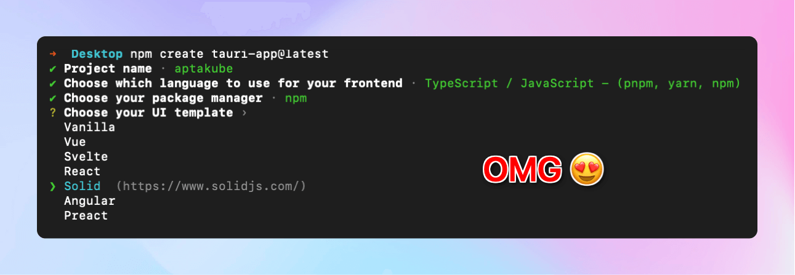

import osAnalytics from "../../assets/blog/why-chose-to-build-on-tauri-instead-electron/os-analytics.png?url";
import tauriHome from "../../assets/blog/why-chose-to-build-on-tauri-instead-electron/tauri-home.png?url";
import rustStringMeme from "../../assets/blog/why-chose-to-build-on-tauri-instead-electron/rust-string-meme.jpg?url";

About a year ago (July/2022) I decided to experiment with building a Desktop application.

I wasn't happy with the other apps in the niche I was working on, and I thought I could build something better. I work as a full stack developer for a very long time, but I had never built a desktop application before.

My first thought was to build with SwiftUI. Developers love native apps, and I've always wanted to learn Swift. However, building on SwiftUI would limit my audience to macOS users only. I had a feeling that most of the users would be on macOS anyway, but why limit myself when I could build a cross-platform app?

Looking back now, I'm really glad I discarded SwiftUI early on. Just look at the diverse number of operating systems that people are using my app on.

<figure>
  
  <figcaption>
    Windows + Linux represents more than 35% of the users. That is like giving
    away 35% of my revenue.
  </figcaption>
</figure>

## What about Electron?

I don't live under a rock, so I knew that [Electron](https://www.electronjs.org/) was a thing and that many of the popular apps I use daily are built on Electron, including the editor I'm using right now to write this post. It seemed like a perfect fit for what I was trying to do, because:

- ✅ Single code base can target multiple platforms
- ✅ Works with React + TypeScript + Tailwind, which I'm already familiar with
- ✅ Very popular = lots of resources and guides
- ✅ NPM is the largest (is it?) package ecosystem out there, it means I can ship things faster

The other benefit of building on Electron meant I'd be able to focus on building the app rather than learning something completely new. I love learning new languages and frameworks, but I wanted to build something useful quickly. I'd still have to learn about Electron itself, but it wouldn't be as steep as learning a new Swift and SwiftUI.

## Okay, let's get started!

I was settled. [Aptakube](https://aptakube.com) was going to be built with Electron.

I normally don't read the documentation. I know I should, but I don't. However, I always read the `Getting Started` section whenever I pick a framework for the first time.

Popular frameworks have a `npx create {framework-name}` that quickly bootstraps an app for us. Next.js, Expo, Remix and a lot of others have this. I found this super useful because they allow you to get started quickly, and they often give you a bunch of options like:

- Do you want Typescript or JavaScript?
- Do you want to use a CSS framework? What about Tailwind?
- Prettier and/or ESLint?
- Do you want this or that?

The list goes on. It's such a great developer experience that I wish every framework had one.

## Can I just `npx create electron-app`?

Apparently I can't, or at least I haven't found a way to do it, certainly not on the `Getting Started` section.

What I found instead was a `quick-start` template that I could clone from Git, install the dependencies, and be on my way.

However, it's not TypeScript, there is no bundler, no CSS framework, no linting, no formatting, no nothing. It's just a bare bones app that opens a window.

I started building with this template and adding all the things I wanted to make it work. I thought it would be easy, but it wasn't.

An electron app has 3 entry points: `main`, `preload` and `renderer`. Wiring that all up with Vite was painful. I spent around 2 weeks of my free time trying to get everything working. I failed, and I got frustrated.

I then found dozens of other boilerplates for Electron. I tried about 5 of them. Some were actually OKish, but I was a bit put off by the fact that most templates were too opinionated and installed way too many dependencies that I didn't even know what they were used for. Some didn't even work at all as they've been abandoned for years.

In summary, the developer experience for someone who is new to Electron is below average. Next.js and Expo have set the bar so high that I've come to expect that every framework would offer a similar experience.

## So what now?

While mindlessly scrolling through Twitter I saw a tweet from [Tauri](https://twitter.com/TauriApps) about the 1.0 release. Apparently they've been around for 2 years at that point, but I had no idea what Tauri was. I went to their website, and I was blown away 🤯. It seemed like exactly what I was looking for.

Do you know the best part? They had a `npm create tauri-app` instruction right there on the home page.

<figure>
  
  <figcaption>
    Tauri nailed the developer experience from day 1 with the `npx create
    tauri-app` command.
  </figcaption>
</figure>

I decided to give it a try. I ran create the tauri-app command and the experience was very similar to Next.js. It asked me a few questions and then it created a new project for me based on my choices.

At the end of the process I could simply run `npm run dev` and I had a working app with hot-reload, TypeScript, Vite and Solid.js, pretty much everything I needed to get started. I was impressed, and excited to learn more about. I had to add Prettier, Linters, Tailwind and all that kind of stuff, but I'm used to it and it was easier than in Electron.

## Getting started (again 😅), but with Tauri

While in Electron I could build the whole app with just JavaScript/HTML/CSS, in Tauri you the backend is in Rust and only the frontend is JavaScript. That obviously meant I had to learn Rust, which I was excited to, but also did not want to spend much time on it as I wanted to build the prototype quickly.

I've used 7+ programming languages professionally, so I thought learning Rust would be a walk in the park.

I was wrong. I was so wrong. Rust is hard, like really hard, or at least it was for me!

One year later, and more than 20 releases of my app were released, I still can't say I truly know Rust. I know enough to be constantly shipping new features on a regular basis, but I'm still learning so much every time I have to write something in Rust. GitHub Copilot and ChatGPT have been a huge help, and I still use them both a lot.

<figure>
  
  <figcaption>
    Something as simple as using strings is a lot more complicated in Rust than
    in other languages 🤣
  </figcaption>
</figure>

However, there is something in Tauri that makes that makes this process a lot easier.

Tauri has the concept of a `Command`, which is like a bridge between the frontend and backend. You can define commands in your Tauri backend using Rust and call them from JavaScript. Tauri itself provides a bunch of commands that you can use out of the box. For example, you can open a file dialog, read/update/delete a file, make HTTP requests and a bunch of other interactions with the operating system right from JavaScript, without having to write any Rust code.

Well, what if you need to do something that is not available on Tauri? That's where `Plugins` come in. Plugins are Rust libraries that defines commands you can use in your Tauri app. I'll talk more about plugins later, but just think of them as a way to extend Tauri's functionality.

I've actually asked a lot of people building apps in Tauri if they had to write Rust code to build their apps. Most of them said they had to write very little Rust for some niche use cases. It's totally possible to build a Tauri app without writing any Rust code at all!

## So how does Tauri compare to Electron?

### 1. Programming Language and Ecosystem

In Electron, your backend is a Node.js process and your frontend is Chromium, which means a web developer can build a desktop app with just JavaScript/HTML/CSS. There's a huge ecosystem of libraries on NPM and there is just so much content about it on the internet that makes the learning process a lot easier.

However, while it's generally seen as a good thing being able to share code between backend and frontend, it can also get confusing as developers might try to use backend functions on the frontend and vice versa. So you'd have to be careful to not mix things up.

In contrast, Tauri's backend is Rust and the frontend is also a webview (more on this next). While there's a significant amount of Rust libraries, it's nowhere near the size NPM. The Rust community is also a lot smaller than the JavaScript community, which means there's less content about it on the internet. But as mentioned above, depending on what you'll be building, you might not even need to write much Rust code at all.

**My opinion:** I simply love the clear separation of backend and frontend that we get in Tauri. If I'm writing a piece of code in Rust, I know it'll be running as an OS process and I have access to network, file system and a bunch of other things, while everything I have written in JavaScript is guaranteed to be running on a webview. Learning Rust has not been easy for me, but I'm enjoying the process, and I'm learning a lot of new things in general! Rust is started to grow in me 😊

### 2. Webview

In Electron, the frontend is a Chromium webview that is bundled with the app. This means you can always be certain of what version of Node.js and Chromium version used by your app, regardless of the operating system. This comes with major benefits, but also some drawbacks.

The biggest benefit is the ease of development and testing, you know what features are available and if something works on macOS, it'll more than likely work on Windows and Linux as well. The drawback however is that you app size will be a lot bigger because of all these binaries bundled into your app.

Tauri takes a drastically different approach. Instead of bundling Chromium with your app, it uses the operating system's default webview. This means that on macOS your app will use WebKit (Safari's engine), on Windows it'll use WebView2 (which is based on Chromium) and on Linux it'll use WebKitGTK (same as Safari's).

The end result is an extremely small app size that feels superfast!

As a reference, my Tauri app weights 24.7MB on macOS, while my competitor's app (Electron) weights 1.3GB. 😱

Why does it matter?

- It's so much faster to download and install
- Costs less to host and distribute (I run on AWS so I pay for bandwith and storage)
- I often get asked if my app is built with Swift as users usually have a "this feels like a native app" moment when they see such as small and fast app
- Security is handled by the OS. If there's a security issue with WebKit, Apple will release a security update and my app will simply use it. I don't have to ship and updated version of my app to fix it.

**My opinion:** I like the fact that my app is so small and fast. I was initially worried about the lack of consistency between operating systems, because that meant I need to test my app on all 3 operating systems, but I haven't had any issues so far. Web developers are used to this anyway as we have been building multi-browser apps for such a long time. Bundlers and polyfills also help a lot on this regard!

### 3. Plugins

I briefly mentioned this before, but I think it's worth going into more details as it's one of the best features of Tauri in my opinion. A plugin is basically a collection of Commands written in Rust that can be called from JavaScript. It allows developers to compose applications by putting together different plugins that can either be open source or defined within your app app.

It's a nice way of structuring an app, and it makes it easy to share code between different apps too!

Some examples of plugins you'll find in the Tauri ecosystem:

- [tauri-plugin-log](https://github.com/tauri-apps/tauri-plugin-log) - Configurable logging.
- [tauri-plugin-store](https://github.com/tauri-apps/tauri-plugin-store) - Configurable logging.
- [tauri-plugin-window-state](https://github.com/tauri-apps/tauri-plugin-window-state) - Persist window sizes and positions.
- [window-vibrancy](https://github.com/tauri-apps/window-vibrancy) - Make your windows vibrant.
- [tauri-plugin-sql](https://github.com/tauri-apps/tauri-plugin-sql) - Make your windows vibrant.
- [tauri-plugin-aptabase](https://github.com/aptabase/tauri-plugin-aptabase) - Analytics for Tauri apps.
- and a [lot more](https://github.com/tauri-apps/awesome-tauri#plugins)...

These features **could** have been part of Tauri itself, but having it separately means you can pick and choose what you want to use. It also means they can evolve independently, and be replaced with alternatives if something better gets released.

The plugin system was actually the second biggest reason why I chose Tauri, it makes developer experience 1000x better!

### 4. Feature Parity

When it comes to feature, both Electron and Tauri are very similar. Electron still has a few more features, but Tauri is catching up fast. At least for my use case, Tauri has everything I need.

The only major inconvenience for me was the lack of a `Native Context Menu` API. This is a [highly requested feature](https://github.com/tauri-apps/tauri/issues/4338) by the community and would make Tauri apps feel a lot more native. I'm currently doing this with JS/HTML/CSS which is OK, but could be better. Hopefully we'll see this land in Tauri 2 🤞

But other than that, there's plenty in Tauri. Right out the box you get: notifications, tray, menu, dialog, file system, networking, window management, auto updating, packaging, code signing, GitHub actions, sidecars, etc. And if you need something else, you can always write a plugin for it, or use one of the existing ones.

### 5. Mobile

This one came as a surprise to me. At the time I'm writing this, Tauri has experimental support for iOS and Android. It seems like it was always part of the plan, but I didn't know about it when I started my app. I'm not sure if I'll ever use it, but it's nice to know it's there.

This is something that is not possible with Electron, and probably never will be. So if you're planning to build a cross-platform mobile and desktop app, Tauri may be the way to go as you'd likely be able to share a lot of code between them. Designing mobile-first interfaces with web technologies got a lot easier over the years, so building a single interface that could run as a desktop and mobile app is not as crazy as it sounds.

## Conclusion

I'm very happy with my decision to use Tauri. Combined with Solid.js I was able to make an app that is really fast, and people love it! I'm not saying it's always better than Electron, but if it has the features you need, I'd say give it a try! As mentioned before, you might not even need to write that much code in Rust, so don't get intimidated by that! You'll be surprised by how much you can do with just JavaScript.

In case you're into Kubernetes, check out [Aptakube](https://aptakube.com), a Kubernetes Desktop Client for macOS, Windows and Linux built with Tauri 😊

I'm now working on an [open source and privacy-friendly analytics platform](https://aptabase.com) for dekstop and mobile apps. It already has SDKs for various different frameworks, including Tauri and Electron. By the way, the Tauri SDK is packaged as a Tauri Plugin! 😄

Lastly, I'm also active on [Twitter](https://twitter.com/goenning). Feel free to reach out if you have any questions or feedback, I love talking about Tauri!

Thanks for reading! 👋
