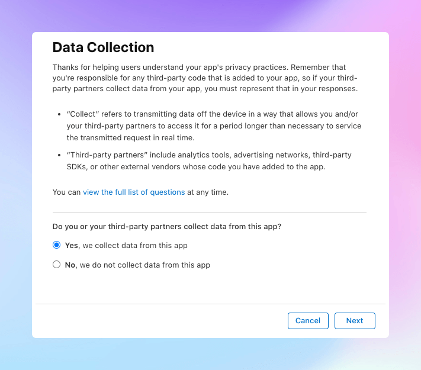
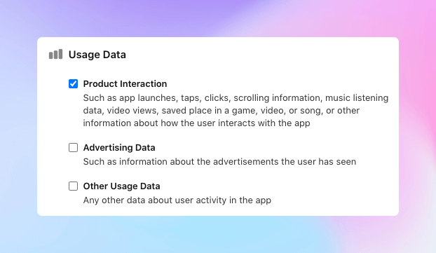
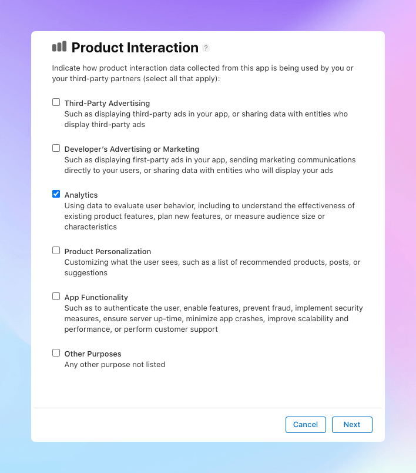
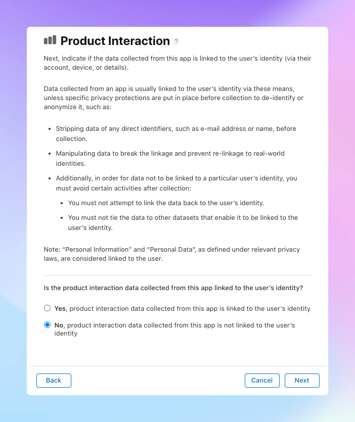
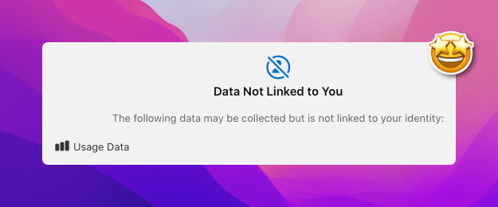

## Introduction

Since December 2020, Apple requires you to fill out the `App Privacy` form when you submit your app to the App Store. This form is used to inform users about the data your app collects and how it is used, much like a Privacy Policy, but in a more standardized and user-friendly format.

If you're using Aptabase for analytics, you'll have to disclose that you're collecting some information which is described in this guide.

Being a privacy-first platform makes it easy to fill out this form. We only collect the bare minimum to provide you with analytics, while keeping it completely anonymous and free of any user identification or personal data.

## Let's get started

Find the `App Privacy` menu on App Store Connect and click on `Get Started`.

**Do you or your third-party partners collect any data from this app?**

Make sure to select `Yes` for this question as you're collecting some data.

For the next question you'll be asked to select the data types you collect. The answer will depend on all features of your app and we cannot provide a definitive answer for you. However, in regards to Aptabase the only data types you need to select is `Product Interaction` under the `Usage Data` section.

You do not have to select any of the data types under `Identifiers` because Aptabase does not collect use any of those.

You'll then be asked to expand on how you use the Product Interaction data. Select `Analytics` as the answer.

Then next question is related to User Identification. Because all data points collected by Aptabase are free of any user identification, you can safely select `No` for this question.

Following that, they'll explain their definition of what `Tracking` is and ask you to confirm if you track users.

**tl;dr;** Apple only considers tracking when data is linked to an user's identity and used for targeted advertising or advertising measurement purposes, which is not something we do with Aptabase.

As Aptabase does not fall under this definition, you can safely select `No` for this question as well.

## That's it! 🎉

After following all these steps, you'll be presented a preview of what users will see on your App page, which may be something minimal like this if you're only using Aptabase:

