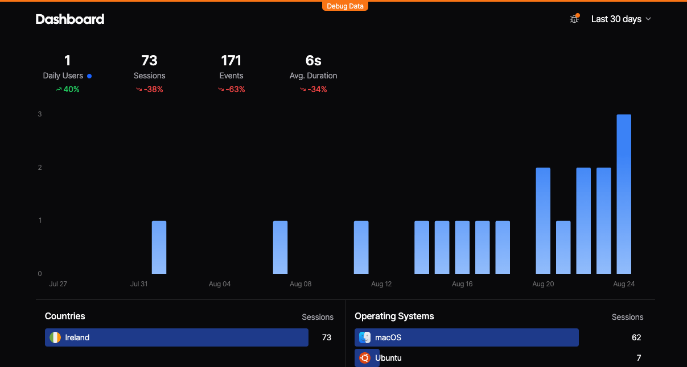
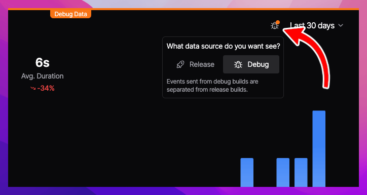

Every Aptabase SDK has support for two build modes: `Debug` and `Release`.

These modes are used to differentiate between development and production builds of your app as we keep your data separate between the two.

During development, the events you send to Aptabase will be sent as part of the `Debug` build mode, which allows you to experiment with different events and data structures without affecting your production data.

Once you're ready to release your app, you can simply build your app as usual and the SDK will automatically switch to the `Release` build mode and send your events to the correct place.

There is nothing you need to do to enable or configure for this feature, it's built-in to the SDK and works out of the box.

## Aptabase Dashboard

In your Aptabase Dashboard you'll be able to see the data for each build mode separately.

The `Debug` mode is marked with an orange ribbon on the top of the screen, while the `Release` mode does not. Here's an example of what it looks like when you're in `Debug` mode:

To switch between Debug and Release, use the Bug/Rocket icon on the top right of the screen as shown below, beside the date picker.

